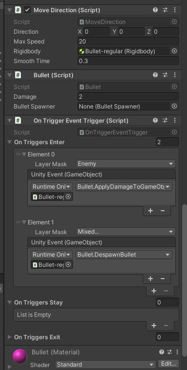
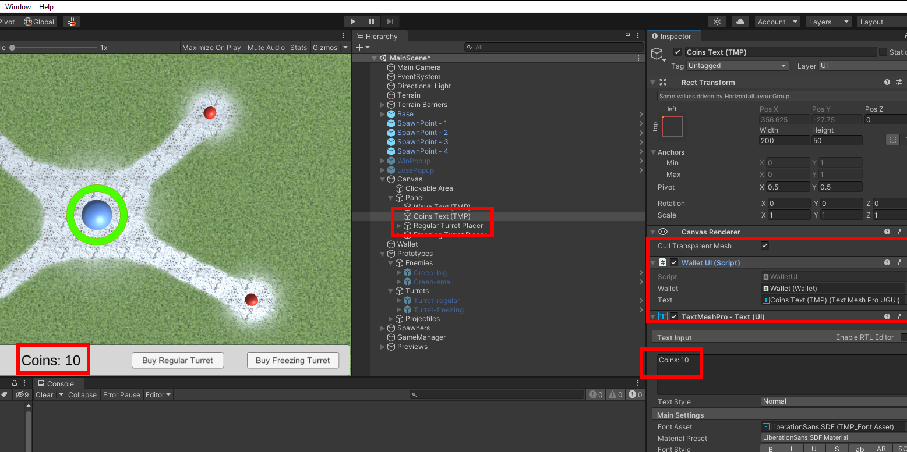
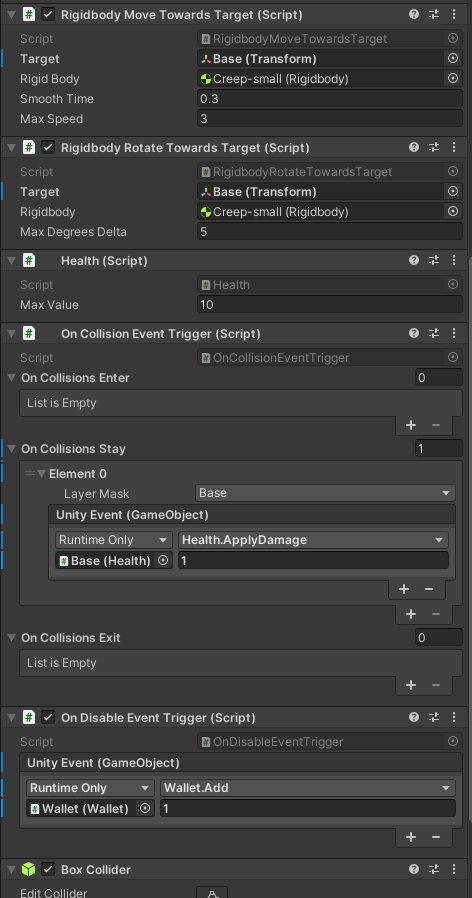
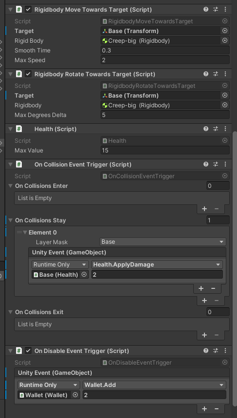
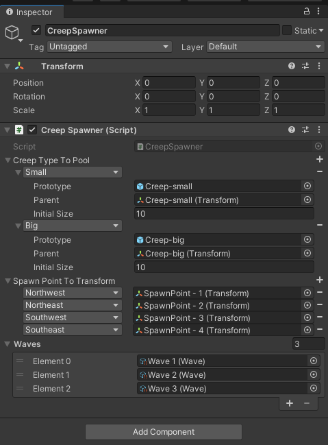
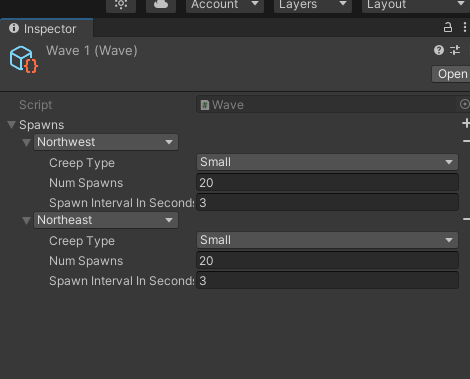
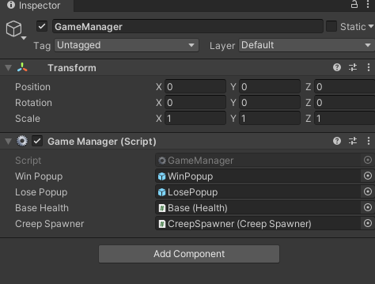

# Scopely Challenge

In this technical document, I will explain how the project works, how to maintain it and how to extend its features. This project is a simple tower defense game where enemies come in waves towards your base in the center of the map. Your mission is to position turrets that will defend your base. The game ends if either your base is destroyed or all enemies are defeated.

## Turrets

Turrets are made of two core components: a BulletSpawner and an Attack Radius. A BulletSpawner [Figure 1] is a game object that can spawn bullets out of a object pool. What kind of bullet is spawned is up to you. For example, in this project, we have two different kinds of turrets, the regulars and the freezing ones: the first shoots regular bullets that deal 2 points of damage while the former deals 1 point but slows down enemies. Meanwhile, the turret has no idea what kind of bullet it is shooting.

 
**Figure 1:** BulletSpawner Inspector

Turrets [Figure 2] know where to shoot thanks to the attack radius. It is a sphere trigger which stores the enemies that are inside of it. The turret then checks which enemy is closer and shoots it. It is possible to increase or decrease the attack radius in the Turret inspector.

 
**Figure 2:** Turret Inspector

Turrets are created by clicking on the buy buttons on the bottom UI of the game. To create new Buy Buttons and offer other kinds of turrets, you must first define a new TurretType in the TurretSpawner script [Figure 3]. Next, you must create a turret prototype [Figure 4] that will be added to the scene. Then, add your new Turret Type, along with the Turret Prototype to the Turret Spawner script [Figure 5].

 
**Figure 3:** Turret Spawner Inspector

 
**Figure 4:** Prototypes

 
**Figure 5:** Turret Spawner Button Inspector

After that, you need to create a preview [Figure 6], a transparent object that will preview the position of the turret when the player moves the mouse around the screen, after clicking in the buy button [Figure 7] [Figure 8]. You can create a preview by simply cloning the original turret prototype, change its material to transparent and removing all colliders. To conclude, add the preview object to the Turret Spawner Button, along with a price and the Turret Type.

 
**Figure 6:** Preview Turret in the Scene View

 
**Figure 7:** Preview Before Spawning

 
**Figure 8:** Preview After Spawning

If your turret needs a specific type of Bullet [Figure 9], you can create one from scratch, as long as there is a BulletSpawner to create it in the scene. All Bullets must have a MoveDirection and a script that extends from AbstractBullet. AbstractBullet has a method called ApplyEffect which will define what is going to happen, besides damaging, when it collides with a Creep.

 
**Figure 9:** All scripts of a Bullet.

## Wallet

Wallet is the MonoBehaviour that stores the amount of coins necessary to buy new turrets. You get more coins if you destroy enemies. There is also a WalletUI [Figure 10] script that takes both a Wallet and TM_Text component to show these coins.

 
**Figure 10:** WalletUI

## Creeps

Creeps are the enemies of our game. In this game I added two different enemies: small and big. Small Creeps[Figure 11] walks toward the base at a medium pace and have 10 units of health. On reaching the base, this enemy deals 1 units of damage per Fixed Update. When this enemy dies, 1 coin is added to the wallet.

 
**Figure 11:** Small Creep Inspector

Big Creeps walks toward the base at a slower pace than Smalls and have 15 units of health. On reaching the base, this enemy deals 2 units of damage per Fixed Update. When this enemy dies, 1 coin is added to the wallet.

 
**Figure 12:** Big Creep Inspector

It is possible to create new type of creeps, as long as you add a new enum value to CreepType, create a new creep prototype, similar to the ones already added to the project and include it in the CreepSpawner [Figure 13].

 
**Figure 13:** Creep Spawner

## Waves

Besides creating a new type of creep, you must also add it to one of the Waves already present in the game. Right now, the game has 3 enemy waves: you can define, for each of the four spawn points (Northwest, Northeast, Southwest and Southeast), a Creep Type that will be spawned X times in a interval of Y seconds [Figure 14]. It is necessary to include the Wave in the CreepSpawner [Figure 13].

 
**Figure 14:** A Wave Scriptable Object

## GameManager

The GameManager checks the Base's Health and the enemies spawned to check if the win and lose conditions are satisfied. A game is won if, after all enemies are destroyed, the Base's health is higher than zero. However, if the base health goes to zero, the game is lost [Figure 15].

 
**Figure 15:** GameManager
