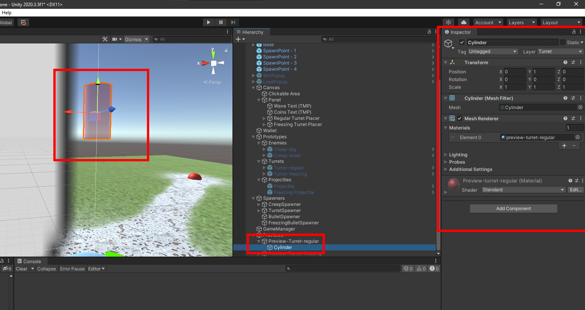

# Scopely Challenge

In this technical document, I will explain how the project works, how to maintain it and how to extend its features. This project is a simple tower defense game where enemies come in waves towards your base in the center of the map. Your mission is to position turrets that will defend your base. The game ends if either your base is destroyed or all enemies are defeated.

## Turrets

Turrets are made of two core components: a BulletSpawner and an Attack Radius. A BulletSpawner [Figure 1] is a game object that can spawn bullets out of a object pool. What kind of bullet is spawned is up to you. For example, in this project, we have two different kinds of turrets, the regulars and the freezing ones: the first shoots regular bullets that deal 2 points of damage while the former deals 1 point but slows down enemies. Meanwhile, the turret has no idea what kind of bullet it is shooting.

 
**Figure 1:** BulletSpawner Inspector

Turrets [Figure 2] know where to shoot thanks to the attack radius. It is a sphere trigger which stores the enemies that are inside of it. The turret then checks which enemy is closer and shoots it. It is possible to increase or decrease the attack radius in the Turret inspector.

 
**Figure 2:** Turret Inspector

Turrets are created by clicking on the buy buttons on the bottom UI of the game. To create new Buy Buttons and offer other kinds of turrets, you must first define a new TurretType in the TurretSpawner script [Figure 3]. Next, you must create a turret prototype [Figure 4] that will be added to the scene. Then, add your new Turret Type, along with the Turret Prototype to the Turret Spawner script [Figure 5].

 
**Figure 3:** Turret Spawner Inspector

 
**Figure 4:** Prototypes

 
**Figure 5:** Turret Spawner Button Inspector

After that, you need to create a preview [Figure 6], a transparent object that will preview the position of the turret when the player moves the mouse around the screen, after clicking in the buy button [Figure 7] [Figure 8]. You can create a preview by simply cloning the original turret prototype, change its material to transparent and removing all colliders. To conclude, add the preview object to the Turret Spawner Button, along with a price and the Turret Type.

 
**Figure 6:** Preview Turret in the Scene View

 
**Figure 7:** Preview Before Spawning

 
**Figure 8:** Preview After Spawning

## Creeps

## Projectiles